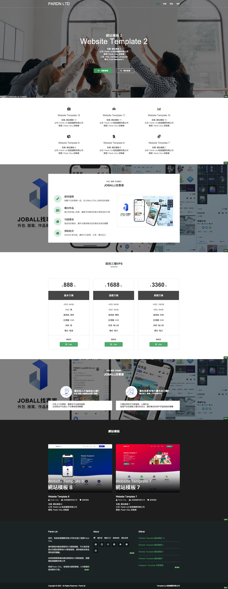

# Website Template 網站模板 2

*於<time datetime="2023-07-07">2023/07/07</time>清除Commits*

## 功能特點

- 使用Html、Css / Sass和JavaScript編寫。
- 使用[Font Awesome 5](https://fontawesome.com/v5/search)圖標和[Freepik](https://www.freepik.com)圖片。
- 可以在[此處](https://pardnchiu.github.io/website-template-2/)進行預覽。
- 可以在[GitHub](https://github.com/pardnchiu/website-template-2)上找到源碼。

## 作者和貢獻者

- [邱敬幃](https://linkedin.com/in/pardnchiu)
- [帕登國際有限公司](https://linkedin.com/company/pardnltd)

## 授權

本源碼項目使用GPL-3.0 license授權。

版權所有 © 2022 [Pardn Ltd 帕登國際有限公司](https://www.linkedin.com/company/pardnltd)
